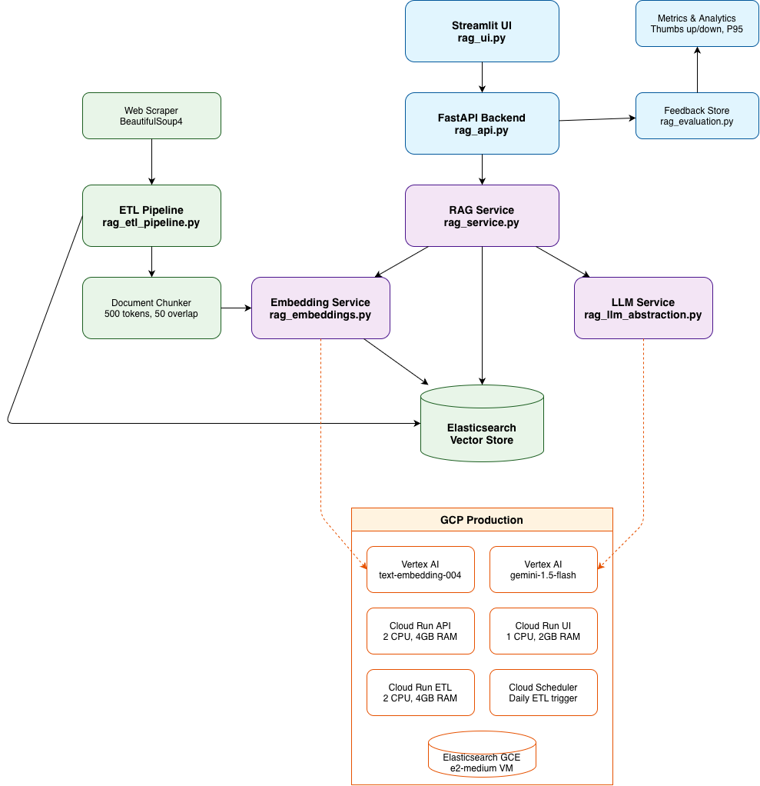

# RAG System Architecture

## System Overview

This is a production-ready Retrieval-Augmented Generation (RAG) system that enables semantic search over internal documentation with AI-powered answers. The system combines vector search with large language models to provide accurate, contextual responses based on your knowledge base.

The system supports both local development (using Ollama and sentence-transformers) and GCP production deployment (using Vertex AI and managed Elasticsearch), with automatic document ingestion, chunking, and vector indexing. It features a modern web UI for querying, comprehensive admin tools for source management, and robust infrastructure with auto-scaling Cloud Run services connected via VPC to a self-hosted Elasticsearch cluster.

The architecture diagram shows the complete data flow from document ingestion through web scraping, chunking with embeddings, vector storage, and finally query processing with LLM generation - all designed to stay within token limits and provide accurate, contextual answers based on your knowledge base.

## Architecture Flow

## Key Components

### Core Services
- **RAG Service**: Orchestrates retrieval and generation
- **Embedding Service**: Multi-provider embeddings (local/GCP)
- **LLM Service**: Multi-provider language models (Ollama/Vertex AI)
- **ETL Pipeline**: Document processing and indexing

### Data Flow
1. **Ingestion**: Web scraper → Document chunker → Embeddings → Vector store
2. **Query**: User query → Embedding → Vector search → LLM generation → Response
3. **Feedback**: User feedback → Metrics → System improvement

### Deployment Options
- **Local**: Docker Compose with Ollama and sentence-transformers
- **GCP**: Cloud Run services with Vertex AI and GCE Elasticsearch

## Configuration

### Chunking Strategy
- **Size**: 300 words (reduced from 500 to avoid token limits)
- **Overlap**: 30 words for context preservation
- **Token Limit**: Stays under 20,000 tokens for Vertex AI embeddings

### Model Configuration
- **Local LLM**: Ollama llama3.2 (3B parameters)
- **Production LLM**: Vertex AI gemini-2.5-pro
- **Embeddings**: 768 dimensions for compatibility

### Infrastructure
- **Elasticsearch**: 8.11 with HNSW indexing
- **VPC**: Connects Cloud Run to GCE Elasticsearch
- **Scaling**: Auto-scaling Cloud Run (0-10 instances)

---

*Last Updated: October 18, 2025*
